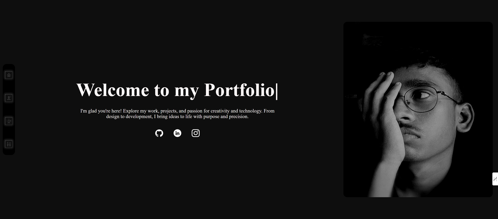

# 🚀 Mrinal Daharia | Developer Portfolio

Welcome to my personal developer portfolio website — a dynamic showcase of my skills, projects, and passion for web development.

 <!-- Replace with actual homepage screenshot if you want -->

---

## 📌 About This Project

This is a responsive portfolio website built from scratch with **HTML, CSS, JavaScript, and PHP**.  
It highlights:

- My journey, skills, and interests in web development.
- Key projects with links to their GitHub repositories.
- A live feedback form to collect messages directly into a MySQL database.

---

## 🌐 Live Site

👉 **[Visit Live Portfolio](https://www.mrinaldaharia.free.nf/)**

Explore the live site to see the smooth animations, responsive layout, and my featured projects.

---

## 🚀 Features

**Animated Single-Page Navigation**  
- Click on icons to smoothly transition between sections (Home, About, Projects, Contact).

**Typing Text Effect**  
- Shows dynamic typing for `"Portfolio"` on the homepage.

**Skill Hover Effects**  
- Skill icons change color on hover for an engaging user experience.

**Responsive Design**  
- Fully adapts to tablets & mobiles with custom media queries.

**Feedback Form**  
- Saves user feedback (name, email, message) into a MySQL database via PHP.

**Client-side Notifications**  
- Displays local notifications after submitting the form (e.g. “Thank you! Your feedback was submitted successfully.”).

**SEO & Social Sharing Optimized**  
- Open Graph, Twitter cards, structured data (JSON-LD) for better search engine indexing and sharing.

---

## 🛠️ Technologies Used

- **Frontend:** HTML5, CSS3, JavaScript (Vanilla)
- **Backend:** PHP + MySQL
- **Database:** MySQL (via InfinityFree)
- **Other:** Google Analytics, Open Graph & JSON-LD for SEO

---

## 🚀 License for Mrinal Daharia's Portfolio

This portfolio project is open for personal and educational use.  
You are welcome to explore, learn from, and adapt ideas for your own personal projects.

However, commercial use, redistribution, or republishing of this code or design without explicit permission is not allowed.

This project is provided "as is" without warranty of any kind.

For permissions or questions, please contact: mrinaldaharia@gmail.com

Copyright ©  2025 Mrinal Daharia
